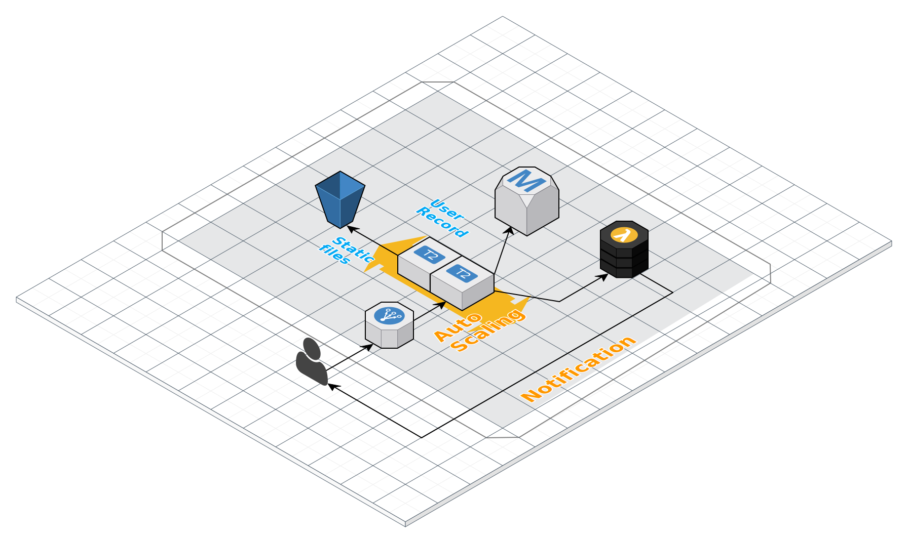
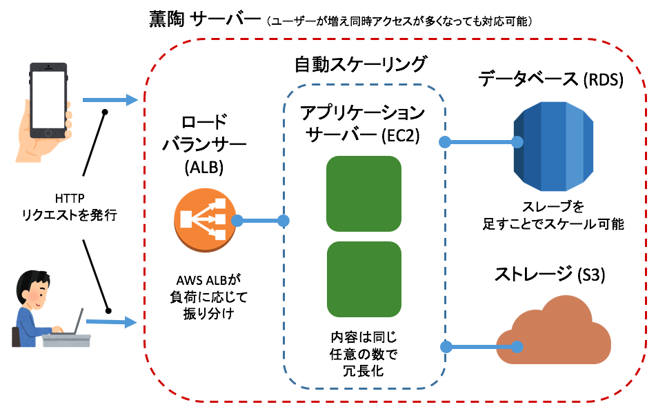

<div name="top" align="center">
  
</div>

<p align="center">
  <b><a href="#demo">Demo</a></b>
  |
  <b><a href="#design">Design</a></b>
  |
  <b><a href="#quickstart">Quickstart</a></b>
  |
  <b><a href="#environment">Environment</a></b>
  |
  <b><a href="#dependences">Dependences</a></b>
  |
  <b><a href="#license">License</a></b>
</p>

Demo
---

<div name="top" align="center">
  
</div>


Design
---






QuickStart
---

```
$ bundle install && yarn
$ cd client && yarn && cd ..
$ postgres -D /usr/local/var/postgres
$ bundle exec rails server
$ bundle exec rake db:create
$ bundle exec rake db:migrate
$ cd client && npm run build:development
```

Environment
---

- example

```
WEBPACKER_DEV_SERVER='http://localhost:8080'
RAILS_API_SERVER='http://localhost:3000'
```

Dependences
---

- **ruby** `>=` 2.4.0
  - **bundler** `>=` 1.15.4
- **node** `>=` 8.0.0
  - **yarn** `>=` 0.24.5
- **postgresql** `>=` 9.4.5

LISENSE
---

- WIP
